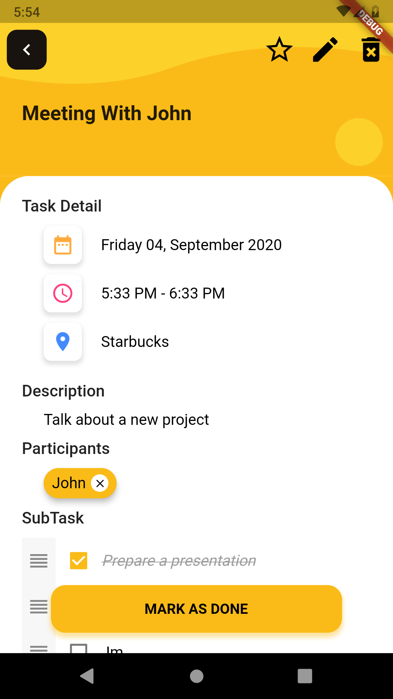

# Tasks Manager

Application that help you manage tasks & event

## Screenshot

</img> </img> </img> </img> </img> </img>

## Changelog

### v1.0.0+2

Refactoring code and fixed some following bugs:

* Showing different tasks in detail screen when open a tasks
* Subtask in editor not showing
* If participants null it will showing description (Detail Screen)
* Can't navigate if open app from notification

### v1.0.0+1

* Initial Release
